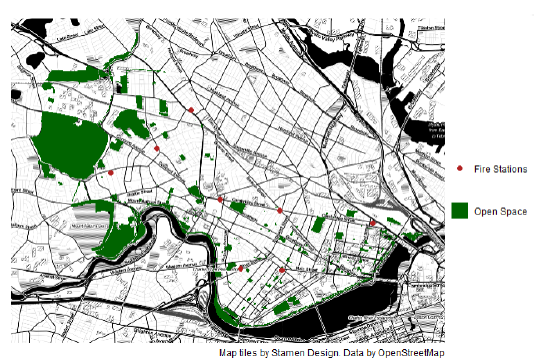
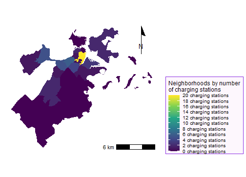
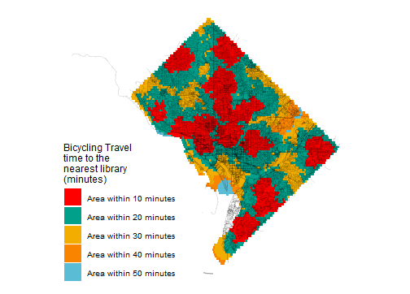
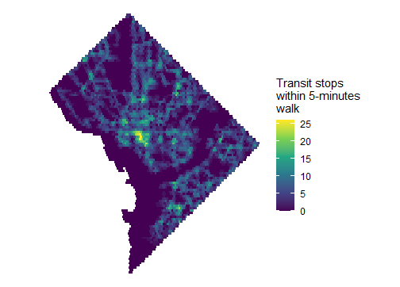
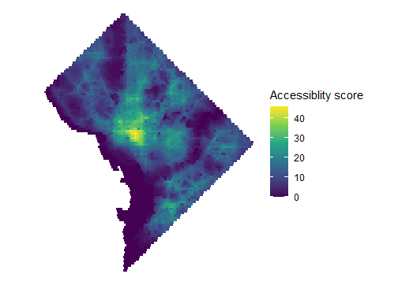
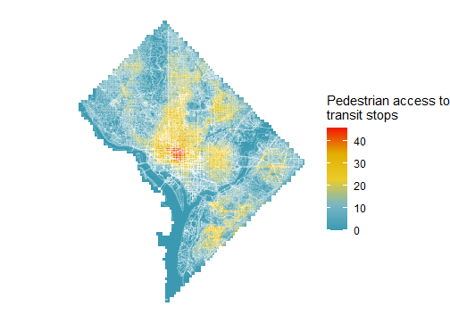
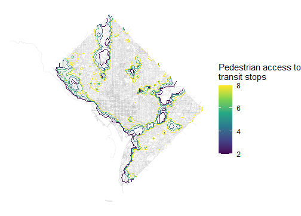

```{r setup, include=FALSE}
knitr::opts_chunk$set(echo = TRUE)
```

# Overview
I developed the following maps in a Spatial Analysis course at the Harvard Graduate School of Design (GSD), working both individually as well as in small groups on various assignments. These maps display a variety of data from publicly-available sources: the U.S. Census Bureau census data from 2010, OpenStreetMaps, GTFS (formerly known as Google Transit Feed Specification), and other sources. This portfolio shows a range of skills I applied using RStudio and GitHub platforms in collecting, modifying, and graphically displaying data in formats potentially useful to urban planners, transportation engineers, other government personnel at various levels (municipal, county, state, and Federal), as well as the general public.


# Depicting Basic Point and Polygon Data
## Map 1: Cambridge, MA
Map 1: Open Spaces and Fire Station Locations in Cambridge, MA

As an introduction to learning mapping skills in RStudio and GitHub, I created this map which displays both polygon data (the shapes of Open Spaces) and point data (locations of Fire Stations) in the city of Cambridge, Massachusetts. [The Open Data portal of the city of Cambridge defines open spaces as: “publicly accessible land that is intended for active or passive recreational use, along with other undeveloped land of natural, scenic, or cultural value”. Source: Cambridge Open Data, https://data.cambridgema.gov/Planning/Open-Space/88i7-ga9f, accessed 10/16/2021.]

The original idea behind displaying this data would be to provide a visual depiction useful to the analysis of proximity between possible locations of unhoused populations (using open spaces as a proxy) and emergency medical services (using fire stations as a proxy since EMTs and Paramedics in the Cambridge are assigned to the city’s fire stations).

This map demonstrates the following skills:

* Displaying multiple vector layers on the same map

[](https://mdeloge9.github.io/portfolio/fullsize/Map1.pdf){target="_blank"}

## Map 2: Boston, M.A.
Map 2: Boston Neighborhoods by Number of Electrical Vehcicle (EV) Charging Stations

This map displays the relationship between electrical vehicle (EV) charging stations in the city of Boston and the city’s neighborhoods. As seen by the yellow coloring, one of Boston’s neighborhoods has a proportionately high concentration of EV charging stations while many portions of the city have very few charging stations if any. Several neighborhoods are in the middle range, each containing somewhere in the range of 4-10 EV charging stations.

This map demonstrates the following skills: 

* Aggregating point data (EV charging stations) to a layer of polygons (Boston neighborhoods)

[](https://mdeloge9.github.io/portfolio/fullsize/Map2.pdf){target="_blank"}


# Displaying Spatial Relationships between Points and Polygons
## Map 3: Washington, D.C.
Map 3: Bicycle Travel Time to Nearest Library in Washington, D.C.

This map calculates the travel time to the nearest public library by bicycle from points on a grid of Washington D.C. using isochrones (i.e., bands of color that represent time periods). In Washington, D.C., libraries are often the location of publicly-available technology centers, providing Internet access and other services to District residents. This map is intended to display how long it would take to reach a library via bicycle from points across the city, showing areas from which a cyclist can reach a library in under ten minutes, between ten and 20 minutes, 20 and 30 minutes, and so on. Please note: This map was created using a color palette inspired by Wes Anderson’s “Darjeeling Limited” movie; in this particular map, blue colors do not indicate water, but rather areas that fall within 40 to 50 minutes of cycling time to reach a District library.

This map demonstrates the following skills: 

* Displaying multiple vector layers on the same map
* Calculating and displaying relationships among point and polygon layers based on distance
* Calculating and displaying accessibility, based on travel time

[](https://mdeloge9.github.io/portfolio/fullsize/Map3.pdf){target="_blank"}

## Map 4: Washington, D.C.
Map 4: Transit Stops Within 5 Minutes Walk in Washington, D.C.

This map uses GTFS data to show the accessibility of transit stops such as bus stops in Washington, D.C. within a 5-minute walk from each point in a grid. Unsurprisingly, locations such as downtown NW Washington, D.C. (the yellow area near the center of the map) indicate a high number of transit stops within a 5-minute walk while areas such as Rock Creek Park (the dark swath to the left of the center near the top of the diamond shape) indicate few or zero transit stops.

This map demonstrates the following skills: 

* Calculating and displaying relationships among point and polygon layers based on distance
* Calculating and displaying accessibility, based on travel time

[](https://mdeloge9.github.io/portfolio/fullsize/Map4.pdf){target="_blank"}


# Mapping Accessibility
## Map 5: Washington, D.C.
Map 5: Accessibility Score of Points in Washington, D.C.

This map calculates and applies an accessibility score to areas throughout the city, based on walking. The color scale makes the center of the city immediately stand out as an area rich with transit options.

This map demonstrates the following skills: 

* Calculating and displaying relationships among point and polygon layers based on distance
* Calculating and displaying accessibility, based on travel time

[](https://mdeloge9.github.io/portfolio/fullsize/Map5.pdf){target="_blank"}

## Map 6: Washington, D.C. 
Map 6: Pedestrian Access to Transit Stops in Washington, D.C.

This map, using a raster layer, shows the walkability of transit stops throughout DC. Using the "Steve Zissou"-style Wes Anderson color palette for the scale strongly differentiates the different levels of access.

This map demonstrates the following skills: 

* Converting between raster layers and vector layers
* Displaying raster data on a map
* Georeferencing a raster image

[](https://mdeloge9.github.io/portfolio/fullsize/Map6.pdf){target="_blank"}

## Map 7: Washington, D.C.
Map 7: Pedestrian Access to Transit Stops as Polygons in Washington, D.C.

Similar to the previous map, this map, using a raster layer, shows the walkability of transit stops throughout DC. The polygon boundaries of the accessibility raster are different in this map, appearing here as contour lines, showing accessibility on a color gradient.

This map demonstrates the following skills: 

* Converting between raster layers and vector layers
* Displaying raster data on a map
* Georeferencing a raster image

[](https://mdeloge9.github.io/portfolio/fullsize/Map7.pdf){target="_blank"}


# Interactive Mapping
## Map 8: Coconino County, A.Z.
Map 8: Census Blocks in Arizona’s Coconino County Identified by American Indian Residents

Using data from the 2010 U.S. Census, this interactive map allows the user to zoom in on Coconino County in Arizona to see which census blocks contain residents that self-identified as American Indian and Alaskan Native alone. Having earned my MBA in this county (at Northern Arizona University in the county seat of Flagstaff) I was interested in seeing the American Indian percentage by Census Tract given that there are significant populations of Navajo, Hopi, and other Native American groups in Coconino County.

This map demonstrates the following skills: 

* Displaying data on an interactive map

[](https://mdeloge9.github.io/portfolio/fullsize/Map8.html){target="_blank"}


